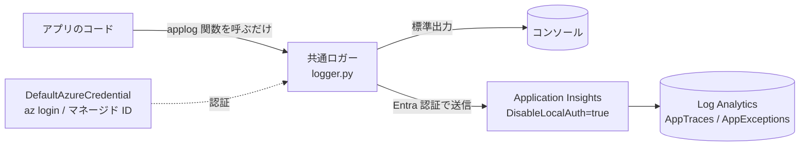

# Python アプリログを Application Insights に送信するサンプル

Python アプリケーションのログと例外を Application Insights に集約するための、小さな共通ロガーを作成した。`print` を書く感覚で `applog()` を呼ぶと、標準出力と Application Insights の両方へ、ローカル開発でもデプロイ後でも同じインターフェースで出力できる。出力先や挙動は環境変数で制御し、アプリ実装とは疎結合なので付加情報などの拡張もしやすい。

## 構成

アプリは共通関数 `applog()` を呼ぶだけ。ロガー（`logger.py`）が、環境変数の設定に従って標準出力と Application Insights の両方へ振り分ける。取り込まれたテレメトリは Workspace ベースの Log Analytics に格納され、`AppTraces`（ログ）や `AppExceptions`（例外）として KQL で参照できる。



Application Insights へは Azure Monitor OpenTelemetry Distro 経由で送り、認証は Microsoft Entra ID（`DefaultAzureCredential`）で行う。リソース側は `DisableLocalAuth=true` でローカル認証（インストルメンテーションキー単独送信）を無効化し、送信元プリンシパルに付与した Monitoring Metrics Publisher ロールで取り込みを認可する。接続文字列はテレメトリの宛先を示すルーティング情報で、Entra 認証を有効にしても引き続き必要。ローカルは `az login`、本番はマネージド ID と、認証情報をコードに持たせずに同じコードで動かせる。

## ファイル構成

```
python-appinsights-logger/
├── .env.example          # 環境変数テンプレート
├── logger.py             # 標準出力 + Application Insights へ送る共通ロガー
├── main.py               # applog() の呼び出し例（動作確認用）
├── requirements.txt      # Python 依存関係
└── infra/
    ├── deploy.sh         # 送信先リソース（Log Analytics + Application Insights）を作成
    ├── destroy.sh        # リソース削除
    ├── main.bicep        # リソースグループスコープの Bicep テンプレート
    └── main.bicepparam   # Bicep 用パラメータ
```

## 前提

- Azure CLI でログイン済み（`az login` / `az account set -s <id>`）
- Python 3.10 以上

## 1. 送信先の Application Insights を用意する

ログの送信先となる Application Insights を作成する。既存のリソースを使う場合はこの手順を省略してよい。

```bash
bash infra/deploy.sh
```

`infra/deploy.sh` は次を作成し、完了時に接続文字列を表示する。

- Log Analytics Workspace（`PerGB2018`、保持 30 日）
- Application Insights（Workspace ベース、`DisableLocalAuth=true`）
- 実行ユーザーへの Monitoring Metrics Publisher ロール割当（Application Insights スコープ）

リソースグループ名やリージョンを変更したい場合は [`infra/deploy.sh`](infra/deploy.sh) 冒頭のユーザー調整パラメータを編集する。

## 2. 自分のアプリに組み込む

このロガーは単一ファイル（`logger.py`）のモジュール。Application Insights へ送信する場合は、送信先リソースが用意されていることが前提（手順 1 を実行すれば一式そろう）。

- Log Analytics Workspace と Application Insights（Entra 認証を必須にするなら `DisableLocalAuth=true`）
- 送信元プリンシパル（ローカルは `az login` のユーザー、本番はマネージド ID）への Monitoring Metrics Publisher ロール割当（Application Insights スコープ）

次の手順で自分のアプリに組み込める。

1. `logger.py`・`requirements.txt`・`.env.example` を自分のプロジェクトにコピーする

2. 依存をインストールする

    ```bash
    pip install -r requirements.txt
    ```

3. `.env.example` を `.env` にコピーし、手順 1 で表示された接続文字列を設定して `LOG_TO_APPINSIGHTS=true` にする

    ```bash
    cp .env.example .env
    ```

4. 自分のコードから `applog()` を呼ぶ。`print` を置き換える感覚で使える（`main.py` が呼び出し例）

    ```python
    from logger import applog

    applog("処理を開始")
    applog("想定外の値を検出", level="WARNING")

    try:
        do_something()
    except Exception:
        # try/except 内で呼ぶと例外のスタックトレースが自動で付く
        applog("処理に失敗", level="ERROR")
    ```

`LOG_TO_APPINSIGHTS=false`（既定）なら標準出力だけに出力し、Application Insights には送らない。送信を有効にするには、上記の前提（送信先リソースと Monitoring Metrics Publisher ロール）が必要。`infra/deploy.sh` を使うと一式がそろい、実行ユーザーにロールが付与される。

## 動作確認（このサンプルを実行する）

同梱の `main.py` は `applog()` の呼び出し例で、INFO / WARNING / ERROR のログと例外を送信する。手順 1・2 を済ませた状態で実行する。

```bash
python main.py
```

標準出力にログが出るとともに、数十秒〜2 分程度で Application Insights に反映される。Log Analytics の `AppTraces`（ログ）と `AppExceptions`（例外）で確認できる。

## 環境変数

| 変数 | 説明 |
|---|---|
| `LOG_TO_STDOUT` | 標準出力に出力するか（`true`/`false`） |
| `LOG_TO_APPINSIGHTS` | Application Insights に送信するか（`true`/`false`） |
| `APPLICATIONINSIGHTS_CONNECTION_STRING` | 送信先の接続文字列（宛先） |
| `LOG_SERVICE_NAME` | Application Insights 上の `AppRoleName` として表示される識別名 |
| `LOG_LEVEL` | 出力レベル閾値（`DEBUG`/`INFO`/`WARNING`/`ERROR`/`CRITICAL`） |

## リソース削除

手順 1 で作成したリソースを削除する。

```bash
bash infra/destroy.sh
```

Log Analytics Workspace のソフトデリートまでパージしたうえで、リソースグループを削除する。

