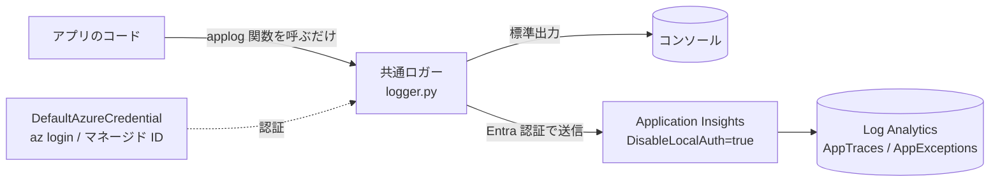
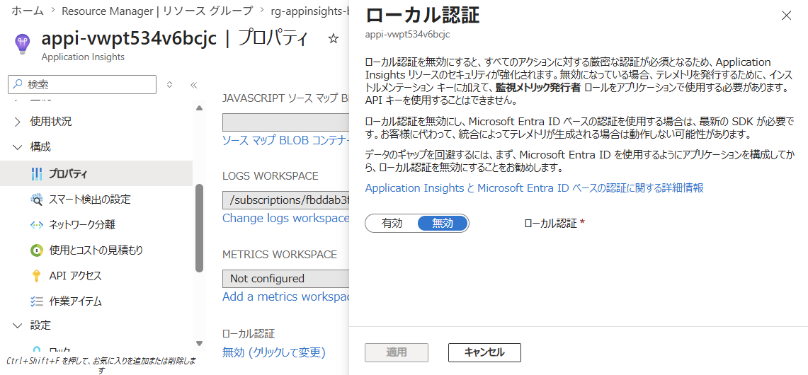
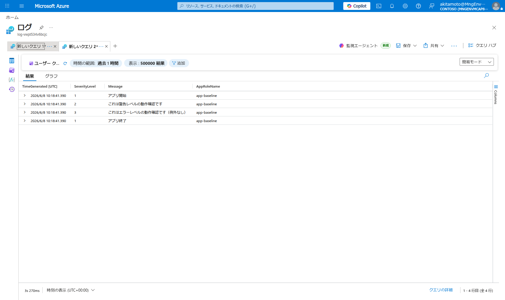
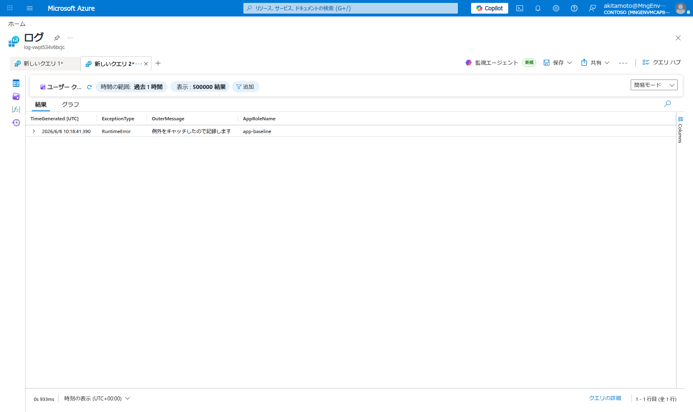

## はじめに

Python アプリケーションのログと例外を Application Insights に集約するための、小さな共通ロガーを作りました。狙いは「`print` を書く感覚でログを残すと、標準出力にもクラウド（Application Insights）にも流れる」状態を、ローカル開発でもデプロイ後でも同じインターフェースで使えるようにすることです。

設計の方針は次の 3 点です。

- **`print` のノリで使える統一インターフェース**：`applog("メッセージ")` の 1 行で書ける。ログレベルや例外のスタックトレースも同じ関数で扱う。ローカル実行でもクラウド実行でも呼び出し側のコードは変わらない。
- **アプリ実装と疎結合で拡張しやすい**：アプリは共通関数を呼ぶだけで、送信先・認証・付加情報といった実装はロガー側に閉じる。後からユーザー情報などの属性を足したくなっても、呼び出し側に手を入れずに拡張できる。
- **挙動は環境変数で制御する**：標準出力の有無、Application Insights への送信の有無、ログレベル、アプリ識別名を環境変数で切り替える。コードを変えずにローカルと本番で挙動を変えられる。

加えて、Application Insights への送信は **Microsoft Entra ID 認証**に対応させています。`DefaultAzureCredential` を使い、ローカルは `az login`、本番はマネージド ID と、認証情報をコードに持たせずに同じコードで動かせます。

本記事では、この共通ロガーの設計と使い方を示し、実際にログ・例外が Application Insights に届くこと、Entra 認証で取り込みが認可されることを確認します。

## アーキテクチャ

アプリは共通関数 `applog()` を呼ぶだけです。ロガー（`logger.py`）が、環境変数の設定に従って標準出力と Application Insights の両方へ振り分けます。Application Insights へは Azure Monitor OpenTelemetry Distro 経由で送り、認証は Microsoft Entra ID で行います。取り込まれたテレメトリは Workspace ベースの Log Analytics に格納され、`AppTraces`（ログ）や `AppExceptions`（例外）として KQL で参照できます。



デプロイするリソースは次のとおりです。

- Log Analytics Workspace（`PerGB2018`、保持 30 日）
- Application Insights（Workspace ベース、`DisableLocalAuth=true`）
- 送信元プリンシパルへの Monitoring Metrics Publisher ロール割当（Application Insights スコープ）

## 設計のポイント

### `print` のノリで使える統一インターフェース

ロガーは `applog()` という 1 つの関数を公開します。`print` を置き換える感覚で使え、ログレベルは引数で指定します。`try/except` の中で呼ぶと、例外のスタックトレースが自動で付与されて `AppExceptions` に送られます。

```python
import logging
import sys


def applog(message, *args, level="INFO", **kwargs):
    """print の代替として使うログ関数。level は "INFO" / "WARNING" / "ERROR" など。"""
    # try/except 内で呼ばれた場合は自動でスタックトレースを付与
    if "exc_info" not in kwargs and sys.exc_info()[0] is not None:
        kwargs["exc_info"] = True
    getattr(_logger, level.lower())(message, *args, **kwargs)
```

呼び出し側はローカルでもクラウドでも同じです。実行環境の違いは環境変数と認証情報が吸収するため、コードを書き分ける必要はありません。

```python
from logger import applog

applog("アプリ開始")
applog("これは警告レベルの動作確認です", level="WARNING")
applog("これはエラーレベルの動作確認です（例外なし）", level="ERROR")

try:
    raise RuntimeError("意図的に発生させた例外")
except RuntimeError:
    applog("例外をキャッチしたので記録します", level="ERROR")

applog("アプリ終了")
```

### アプリ実装と疎結合で拡張しやすい

アプリ側が知っているのは `applog()` だけです。「どこに送るか」「どう認証するか」「どんな付加情報を載せるか」はすべてロガー側に閉じています。出力先を増やす、テレメトリに属性（実行ユーザーやリクエスト ID など）を足す、といった拡張はロガーの実装だけで完結し、アプリのコードには波及しません。

ロガーは Python 標準の `logging` をベースにし、Azure Monitor OpenTelemetry Distro でハンドラーを構成します。`Resource` に指定したサービス名は、Application Insights 上で `cloud_RoleName`（`AppRoleName`）として記録され、複数アプリを 1 つのリソースに送るときの識別名になります。OpenTelemetry をベースにしているため、属性の付与やトレースとの連携といった拡張も無理なく載せられます。

```python
from azure.identity import DefaultAzureCredential
from azure.monitor.opentelemetry import configure_azure_monitor
from opentelemetry.sdk.resources import SERVICE_NAME, Resource

configure_azure_monitor(
    connection_string=connection_string,
    credential=DefaultAzureCredential(),
    logger_name=service_name,
    resource=Resource.create({SERVICE_NAME: service_name}),
)
```

### 挙動は環境変数で制御する

出力先や挙動は環境変数で切り替えます。たとえばローカル開発では標準出力だけ、クラウドでは Application Insights にも送る、といった使い分けがコードを変えずにできます。

| 環境変数 | 役割 |
| --- | --- |
| `LOG_TO_STDOUT` | 標準出力に出力するか（`true`/`false`） |
| `LOG_TO_APPINSIGHTS` | Application Insights に送信するか（`true`/`false`） |
| `APPLICATIONINSIGHTS_CONNECTION_STRING` | 送信先の接続文字列（宛先） |
| `LOG_SERVICE_NAME` | `AppRoleName` として表示されるアプリ識別名 |
| `LOG_LEVEL` | 出力するログレベルの閾値（`DEBUG`〜`CRITICAL`） |

ロガーの初期化はこれらを読むだけで、`LOG_TO_APPINSIGHTS=false` なら Application Insights への送信処理自体を構成しません。

```python
_SERVICE_NAME = os.getenv("LOG_SERVICE_NAME", "python-app-baseline")
_LOG_LEVEL = os.getenv("LOG_LEVEL", "INFO").upper()
_TO_STDOUT = os.getenv("LOG_TO_STDOUT", "true").lower() == "true"
_TO_APPINSIGHTS = os.getenv("LOG_TO_APPINSIGHTS", "false").lower() == "true"
_CONNECTION_STRING = os.getenv("APPLICATIONINSIGHTS_CONNECTION_STRING")
```

### Microsoft Entra 認証に対応する

Application Insights への送信は、接続文字列に含まれるインストルメンテーションキー単独ではなく、Microsoft Entra ID 認証で行います。`configure_azure_monitor` に `credential=DefaultAzureCredential()` を渡すだけで、ローカルは `az login` のトークン、本番はマネージド ID と、同じコードのまま認証情報をコードに持たせずに送信できます。

リソース側は `DisableLocalAuth=true` を設定し、キー単独での送信を無効化して Entra 認証を必須にします。

```bicep
resource appInsights 'Microsoft.Insights/components@2020-02-02' = {
  name: 'appi-${resourceNameSuffix}'
  location: location
  kind: 'web'
  properties: {
    Application_Type: 'web'
    WorkspaceResourceId: logAnalytics.id
    DisableLocalAuth: true
    IngestionMode: 'LogAnalytics'
  }
}
```


*Application Insights のプロパティ。ローカル認証が無効化され、取り込みに Microsoft Entra 認証が必須になっている。*

送信元プリンシパルには **Monitoring Metrics Publisher** ロールを付与します。これにより、接続文字列を知っているだけでは取り込めず、ロールを持つプリンシパルだけが書き込めます。

```bicep
var monitoringMetricsPublisherRoleId = '3913510d-42f4-4e42-8a64-420c390055eb'

resource roleAssignment 'Microsoft.Authorization/roleAssignments@2022-04-01' = {
  scope: appInsights
  name: guid(appInsights.id, principalId, monitoringMetricsPublisherRoleId)
  properties: {
    principalId: principalId
    principalType: principalType
    roleDefinitionId: subscriptionResourceId('Microsoft.Authorization/roleDefinitions', monitoringMetricsPublisherRoleId)
  }
}
```

## 動かしてみる

`LOG_TO_APPINSIGHTS=true` と接続文字列を設定し、ローカルで `az login` 済みのユーザー（Monitoring Metrics Publisher ロールあり）でサンプルを実行します。標準出力にはログがそのまま流れます。

```text
2026-06-08 19:18:41,390 [INFO] app-baseline - アプリ開始
2026-06-08 19:18:41,390 [WARNING] app-baseline - これは警告レベルの動作確認です
2026-06-08 19:18:41,390 [ERROR] app-baseline - これはエラーレベルの動作確認です（例外なし）
2026-06-08 19:18:41,390 [ERROR] app-baseline - 例外をキャッチしたので記録します
Traceback (most recent call last):
  File "main.py", line 13, in main
    raise RuntimeError("意図的に発生させた例外")
RuntimeError: 意図的に発生させた例外
2026-06-08 19:18:41,390 [INFO] app-baseline - アプリ終了
```

## 結果

同じログが、数分以内に Application Insights（Log Analytics）にも取り込まれました。

### ログと例外が取り込まれる

`AppTraces` には INFO（`SeverityLevel=1`）・WARNING（`2`）・ERROR（`3`）のログが並び、いずれも `AppRoleName` が指定したアプリ識別名（`app-baseline`）になっています。`print` の感覚で書いたログが、そのままクラウド側に集約されている状態です。

```text
SeverityLevel  Message                                       AppRoleName
-------------  --------------------------------------------  -----------
1              アプリ開始                                    app-baseline
2              これは警告レベルの動作確認です                app-baseline
3              これはエラーレベルの動作確認です（例外なし）  app-baseline
1              アプリ終了                                    app-baseline
```


*`AppTraces` に INFO / WARNING / ERROR のログが取り込まれ、`AppRoleName` が `app-baseline` になっている。*

`try/except` 内で記録した例外は、`AppExceptions` にスタックトレース付きで届きました。例外処理のたびに送信用のコードを書かなくても、`applog()` を呼ぶだけで例外情報が残ります。

```text
ExceptionType  OuterMessage                      AppRoleName
-------------  --------------------------------  -----------
RuntimeError   例外をキャッチしたので記録します  app-baseline
```


*`AppExceptions` に `RuntimeError` が記録され、スタックトレースも保持されている。*

### Entra 認証で取り込みが認可される

Entra 認証が効いていることも確認しました。同じ接続文字列のまま、送信元プリンシパルから Monitoring Metrics Publisher ロールを外して再実行すると、取り込みエンドポイントが `403 Forbidden` を返し、エクスポーターが認可エラーを記録します。このとき送ったログは Log Analytics に取り込まれませんでした。

```text
Response status: 403
Retryable server side error: Operation returned an invalid status 'Forbidden'.
... Please make sure your Application Insights resource has enabled entra Id
authentication and has the correct `Monitoring Metrics Publisher` role assigned.
```

接続文字列が漏れても、取り込みの可否は RBAC のロールで決まります。アプリ側のコードは変えずに、認可をクラウド側の構成で担保できます。

| 送信元プリンシパル | 接続文字列 | 取り込み | Log Analytics |
| --- | --- | --- | --- |
| ロールあり | 同じ | `200` | 取り込まれる |
| ロールなし | 同じ | `403` | 取り込まれない |

## まとめ

`print` を書く感覚で使える共通ロガーを 1 つ用意することで、アプリのログと例外を標準出力と Application Insights の両方へ、ローカル開発でもデプロイ後でも同じインターフェースで流せるようになりました。アプリ側は `applog()` を呼ぶだけで、送信先・認証・付加情報はロガーに閉じているため、後からの拡張も呼び出し側に波及しません。挙動は環境変数で切り替えられ、ローカルと本番をコードの書き分けなしに運用できます。

認証は Microsoft Entra ID に対応し、`DisableLocalAuth=true` と Monitoring Metrics Publisher ロールにより、接続文字列が漏れても取り込みはロールを持つプリンシパルに限定されます。ログ出力という日常的な処理を、キーレスで安全に、かつアプリ実装から切り離した形で組み込めます。

## 検証コード

@[card](https://github.com/akitamoto-dev/python-appinsights-logger)
